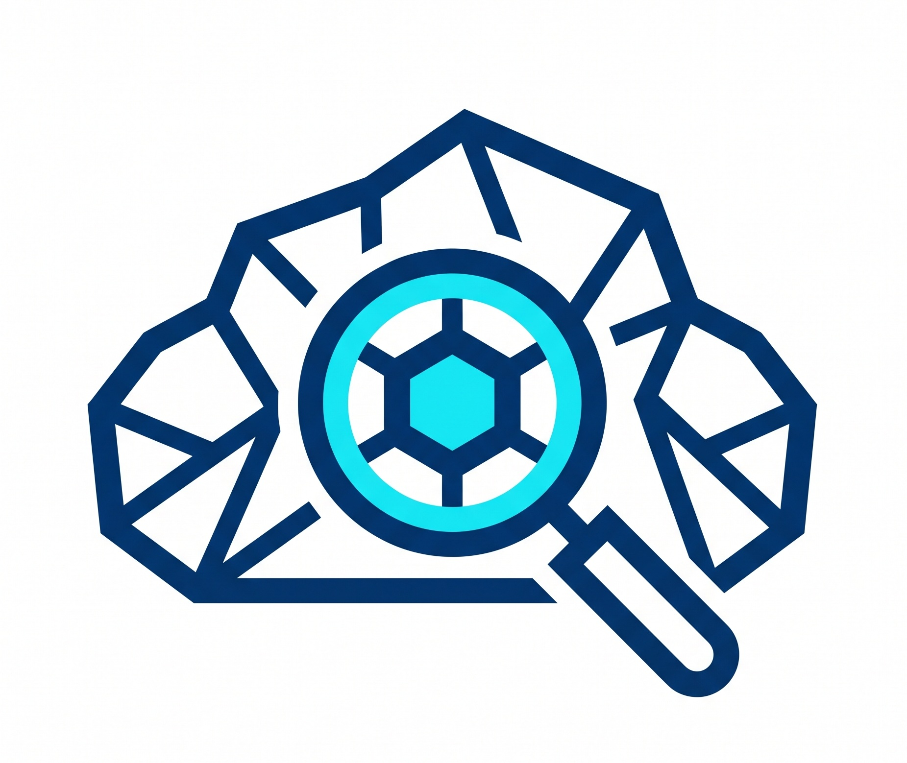
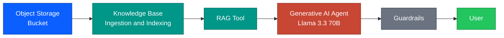

  

  # build-your-own-rag-oci

  **Step-by-step guide to building a RAG pipeline from scratch on OCI**

  
  
  

---

## About

This repository documents, screenshot by screenshot, how to build a Retrieval-Augmented Generation (RAG) pipeline on **Oracle Cloud Infrastructure (OCI) Generative AI Agents**, from an empty tenancy to a working, evaluated chatbot.

No shortcuts, no "trust me it works": every step is captured live from a real OCI console, redacted where needed, and every design decision is explained.

## Table of Contents

- [Features](#features)
- [Architecture](#architecture)
- [Prerequisites](#prerequisites)
- [Guide / Chapters](#guide--chapters)
- [Corpus & Data Disclaimer](#corpus--data-disclaimer)
- [Roadmap](#roadmap)
- [License](#license)

## Features

- Fully managed RAG pipeline on OCI (Object Storage, Knowledge Base, Generative AI Agent)
- Real console screenshots for every step, no abstract diagrams standing in for reality
- Prompt engineering and guardrail configuration explained with before/after comparisons
- Evaluation methodology: one variable per iteration, measured against a fixed question set
- Documented failures and platform limitations, not just the happy path

## Architecture

High-level flow:

1. Source documents go into an **OCI Object Storage** bucket
2. The bucket feeds a **Knowledge Base** (managed ingestion, no separate vector DB to run)
3. The Knowledge Base connects to a **Generative AI Agent** through a RAG tool (routing and generation LLM)
4. Guardrails (content moderation, prompt injection, PII) sit between the agent and the user
5. The agent is exposed via the OCI Runtime API for evaluation and app integration

## Prerequisites

- An OCI tenancy with access to **Generative AI Agents** (available in `eu-frankfurt-1`)
- Basic familiarity with the OCI Console
- Python 3.11+ (for later evaluation scripts)
- A GitHub account

## Guide / Chapters

| # | Chapter | Status |
|---|---|---|
| 1 | [Repo Setup](docs/01-repo-setup.md) | Complete |
| 2 | [OCI Account & Tenancy Setup](docs/02-oci-account-setup.md) | Complete |
| 3 | [Object Storage & Corpus](docs/03-object-storage-corpus.md) | Complete |
| 4 | [Knowledge Base & Agent](docs/04-knowledge-base-agent.md) | Complete |
| 5 | [Prompt Engineering & Guardrails](docs/05-prompt-engineering-guardrails.md) | Complete |
| 6 | [Evaluation](docs/06-evaluation-results.md) | Complete |

## Corpus & Data Disclaimer

All documents used in this project are **fictional**, created specifically for this demo. No real company data, internal documents, or proprietary information appear anywhere in this repository. Any resemblance to real pricing, catalogues, or business terms is coincidental and for illustrative purposes only.

## Roadmap

- [x] Repository structure and README
- [x] OCI tenancy setup and Generative AI enablement
- [x] Object Storage bucket + fictional corpus
- [x] Knowledge Base + Agent creation
- [x] Guardrails configuration
- [x] Prompt engineering iterations
- [x] Evaluation harness + results

## License

Licensed under the [MIT License](LICENSE).
