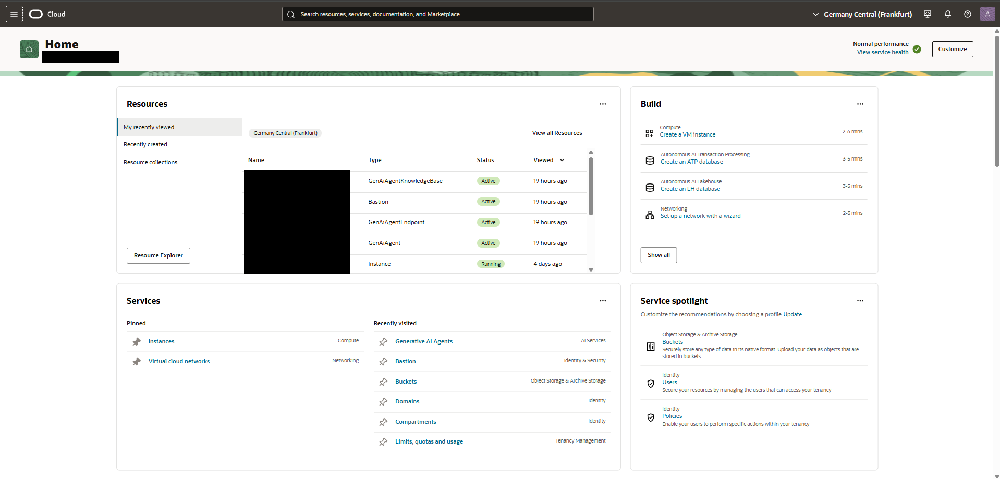

# Chapter 2 — OCI Tenancy & Region Setup

## Introduction

Before creating any project resources, it's worth covering what this guide is actually building.

**Retrieval-Augmented Generation (RAG)** is a pattern that connects a large language model to an external knowledge source at query time, instead of relying only on what the model learned during training. When a user asks a question, the system first retrieves the most relevant pieces of information from a document store, then passes that content to the model alongside the question, so the answer is grounded in real, specific data rather than the model's general knowledge.

This matters for a few practical reasons:

- **Accuracy over general knowledge**: a model can be fluent and still wrong about the specifics of an internal policy, a product catalogue, or a procedure it was never trained on. RAG lets it answer from the actual source document instead of guessing.
- **No retraining required**: updating the knowledge base means adding or replacing documents, not retraining or fine-tuning a model. This is what makes RAG practical for content that changes often — pricing, policies, FAQs.
- **Traceability**: a well-configured RAG system can cite which document supports its answer, which is what makes the evaluation approach in Chapter 6 possible in the first place.
- **Reduced hallucination risk**: when a model is instructed to answer only from retrieved content and to say so when nothing relevant was found, the space for confidently making things up shrinks considerably — though it doesn't disappear entirely, which is exactly why grounding rules and evaluation both matter.

This guide builds a RAG pipeline end to end on OCI Generative AI Agents: object storage holds the source documents, a Knowledge Base handles ingestion and retrieval, and an Agent combines that retrieval with a generation model to produce the final answer. The rest of this chapter covers the first practical step: confirming the environment is ready before any of that gets built.

## Goal
Verify that the OCI tenancy has access to Generative AI Agents and confirm the working region before creating any resources.

## Steps taken
1. Logged into the OCI Console and confirmed the active region: **Germany Central (Frankfurt)** — one of the regions where Generative AI Agents is available.
2. Verified tenancy access to Generative AI Agents under Analytics & AI.
3. Selected a dedicated compartment to isolate all resources created for this project from any pre-existing tenancy resources.

## Screenshot

*OCI Console home page, confirming the active region.*

## Design decisions
- **Frankfurt region**: chosen because Generative AI Agents is available there and it offers low latency for European deployments.
- **Dedicated compartment**: all resources in this guide (bucket, Knowledge Base, Agent) are isolated in their own compartment to avoid interference with pre-existing tenancy resources — good practice for any real deployment, not just this demo.

## Status
Complete
