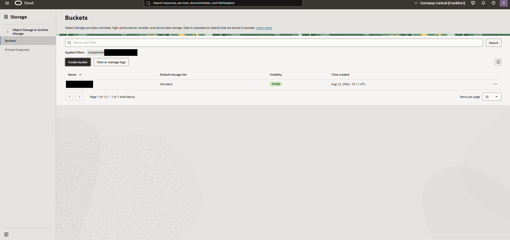
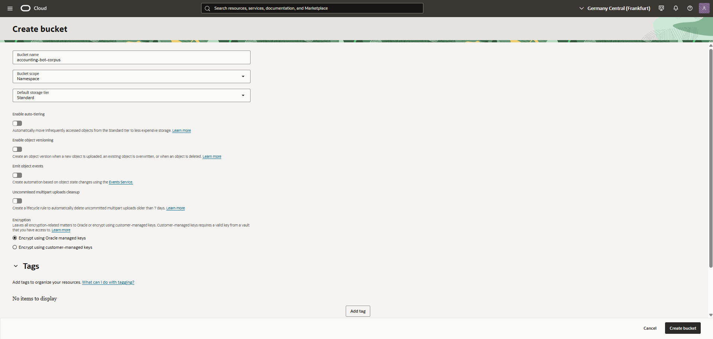
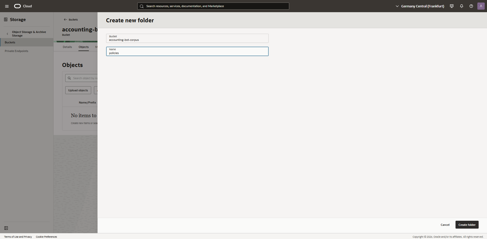
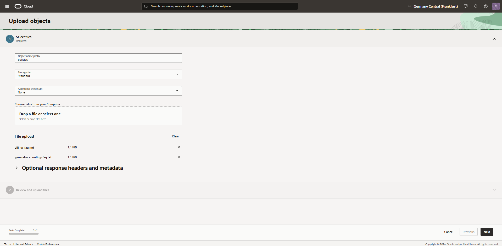
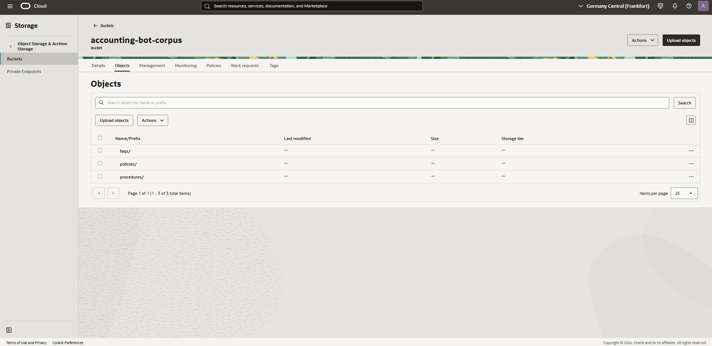

# Chapter 3 — Object Storage & Corpus

## Introduction

A RAG pipeline is only as good as the documents behind it. Before any Knowledge Base or Agent can be created, there needs to be a source of truth: a well-organized set of documents that actually contains the answers users will ask for. This chapter covers that first building block — the Object Storage bucket that holds the corpus this whole project is built on.

## Goal
Create the source-of-truth storage for the RAG pipeline: an Object Storage bucket holding the fictitious accounting document corpus, organized by category.

## Steps taken
1. Created a bucket named `accounting-bot-corpus` (Standard storage tier, Oracle-managed encryption).
2. Created three folders inside the bucket to organize the corpus: `policies/`, `faqs/`, `procedures/`.
3. Uploaded 6 fictitious documents across the three folders: expense policy, data retention policy, billing FAQ, general accounting FAQ, month-end closing procedure, and invoice processing procedure.

## Screenshots

*Object Storage, Buckets, before creating the corpus bucket.*

*Bucket configuration: Standard tier, Oracle-managed keys.*

*Creating the policies folder inside the bucket.*

*Uploading documents into the bucket via the console upload wizard.*

*All three folders present in the bucket, ready to receive documents.*

## Design decisions
- **Folder-per-category structure**: keeps the corpus organized and mirrors how a real document set would be structured, even though the Knowledge Base ingests the whole bucket regardless of folder layout.
- **Fictitious content only**: every document is invented specifically for this demo. See the Corpus & Data Disclaimer section in the main README.

## Status
Complete
