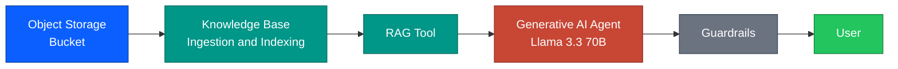
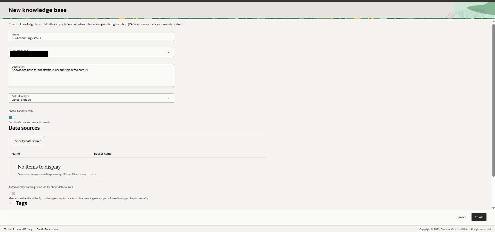
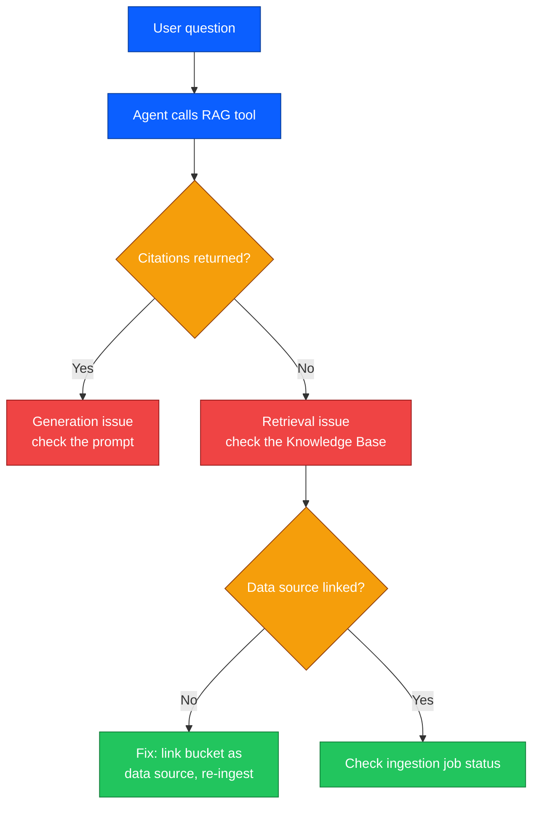
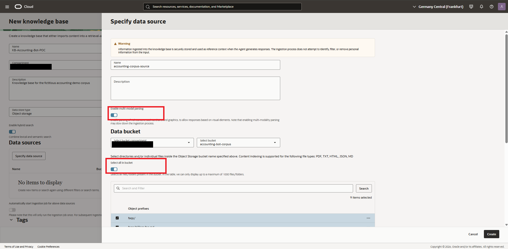
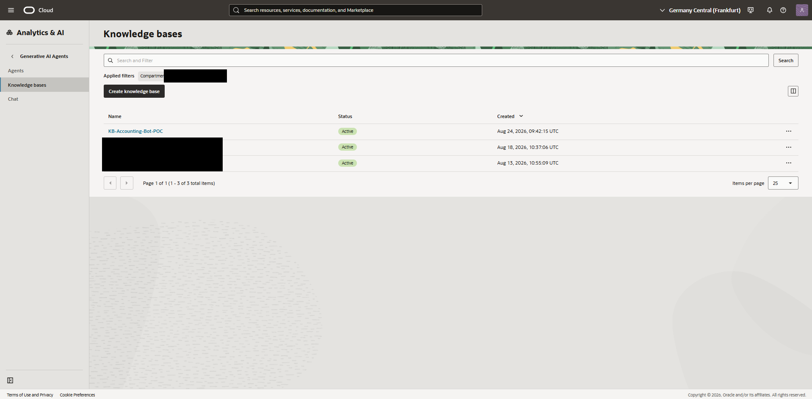
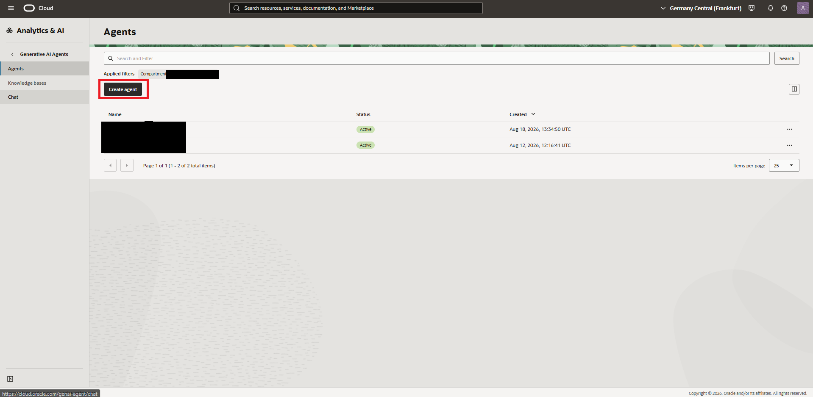
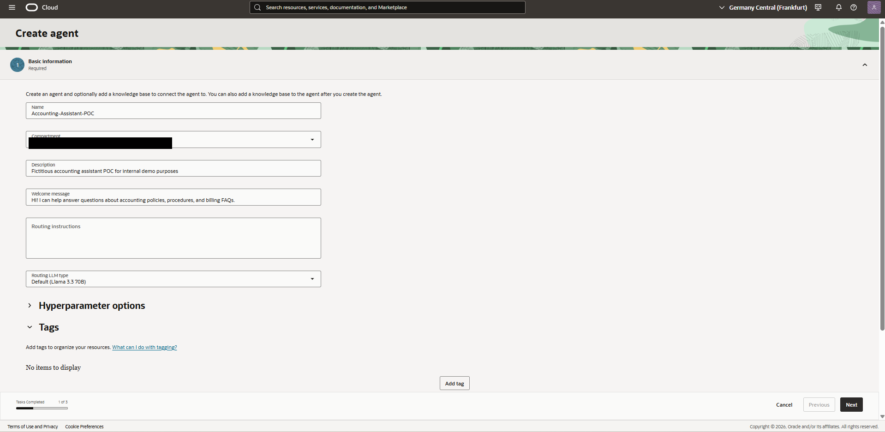
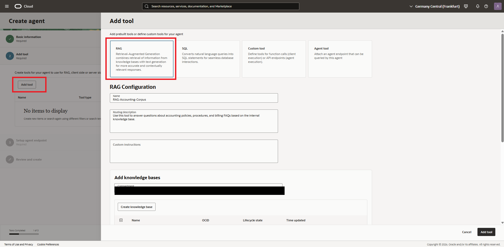
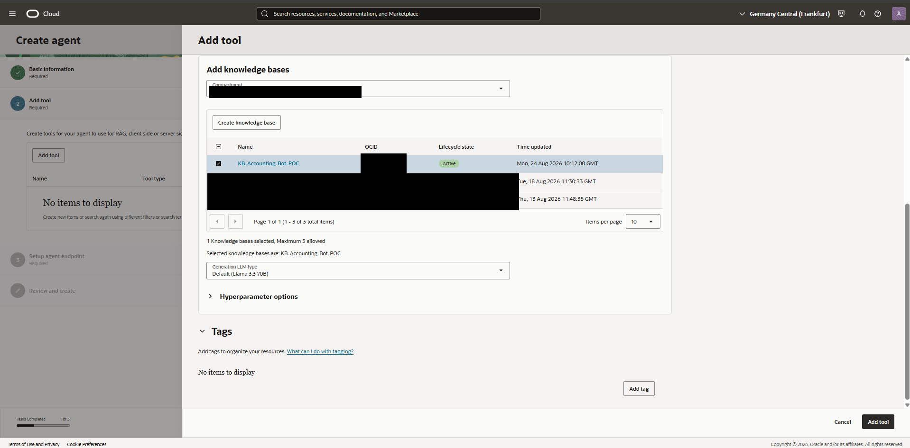

# Chapter 4 — Knowledge Base & Agent

## Introduction

With the corpus in place, the next step is turning raw documents into something a model can actually query. On OCI, this happens in two layers: a **Knowledge Base**, which handles ingestion, indexing, and retrieval, and a **Generative AI Agent**, which wraps a language model around that retrieval through a RAG tool. This chapter builds both, and documents a real bug hit along the way.

## Goal
Turn the corpus into a queryable Knowledge Base and connect it to a Generative AI Agent via a RAG tool.

## Steps taken

### 4.1 Create the Knowledge Base
1. Generative AI Agents, Knowledge Bases, **Create Knowledge Base**.
2. Name: `KB-Accounting-Bot-POC`, data store type: Object Storage.
3. On the first attempt, the Knowledge Base was created **without linking a data source** — the bucket-linking step in the creation wizard was skipped.

*The data sources table shows "No items to display" — this KB has no data linked yet.*

### 4.2 Diagnosing zero citations

Testing the agent against this KB returned "I cannot provide an answer to this query. No reference found for the given query" on every question, with zero citations in the tool output. Following the same diagnostic method used throughout this project — check the citation panel before touching the prompt — this pointed to a retrieval failure, not a generation failure.

### 4.3 Fix: link the data source
1. From the Knowledge Base Data sources tab, **Specify data source**.
2. Pointed it at the `accounting-bot-corpus` bucket with Select all in bucket enabled.
3. Ingestion job ran automatically and completed successfully, indexing all 6 documents.

*Linking the bucket as a data source and selecting all objects for ingestion.*

*Knowledge Base now shows as Active with a linked data source.*

### 4.4 Create the Agent
1. Generative AI Agents, Agents, **Create Agent**.
2. Name: `Accounting-Assistant-POC`, Routing LLM: Default (Llama 3.3 70B).

### 4.5 Add the RAG tool
1. Add tool, **RAG**, connected to `KB-Accounting-Bot-POC`.
2. Generation LLM: Default (Llama 3.3 70B).

## Design decisions
- **Llama 3.3 70B for both routing and generation**: Cohere (`cohere.command-a-03-2025`) was ruled out in earlier testing on this tenancy — it fails with a "chat request type does not match serving model" error.
- **One Knowledge Base per agent, one bucket per Knowledge Base**: kept simple for this POC; the platform supports up to 5 Knowledge Bases per RAG tool if the corpus needs to be split later.

## Known limitation
This chapter's bug is kept in the narrative rather than edited out: it is a realistic failure mode, a required linking step silently skipped in a multi-step wizard, and the diagnostic method used to catch it is the same one used throughout this project.

## Status
Complete
