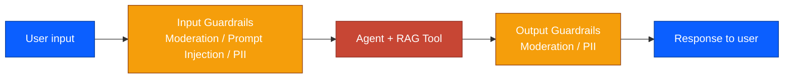
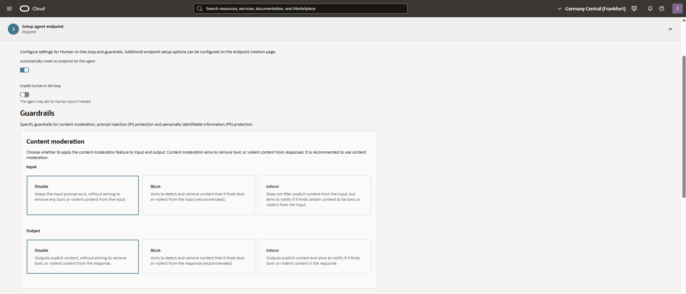
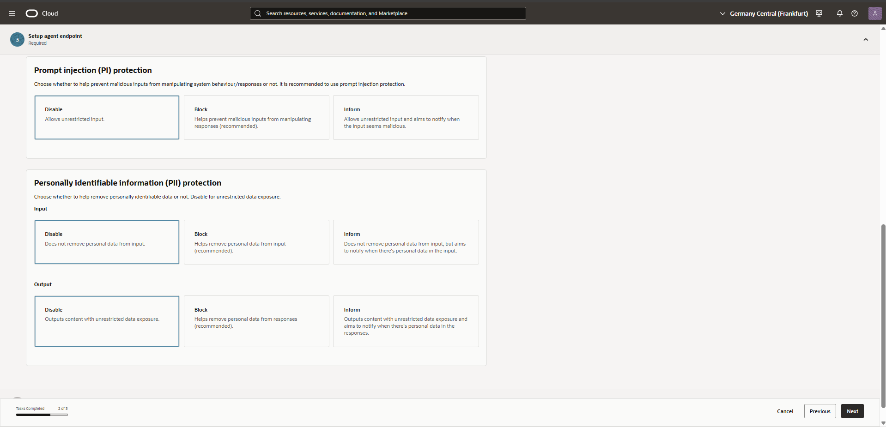
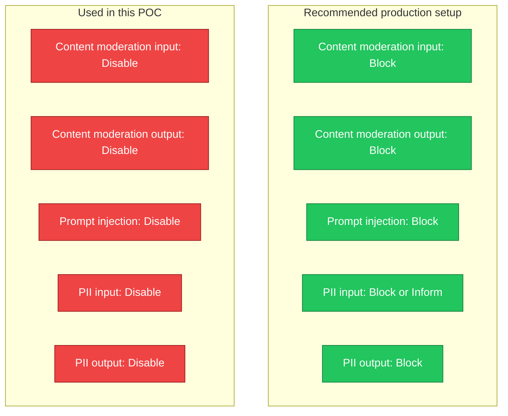
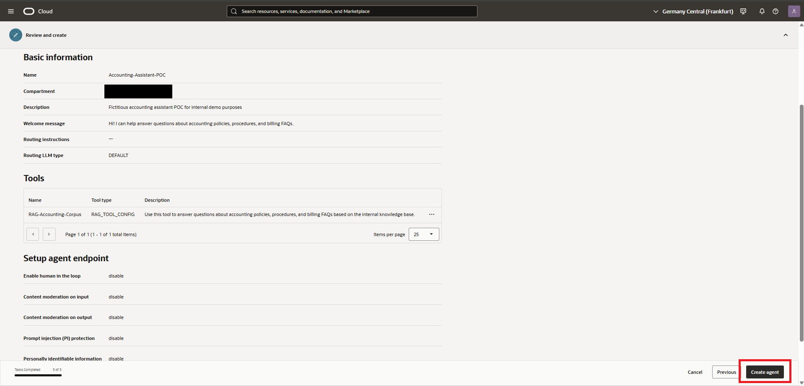
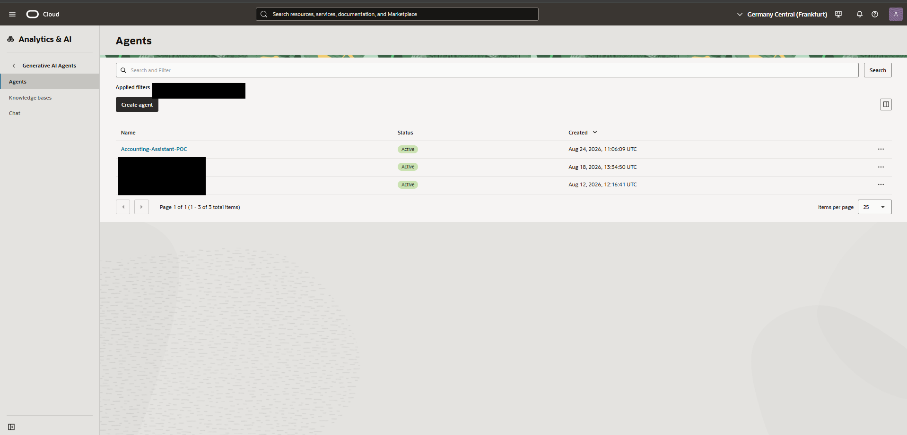
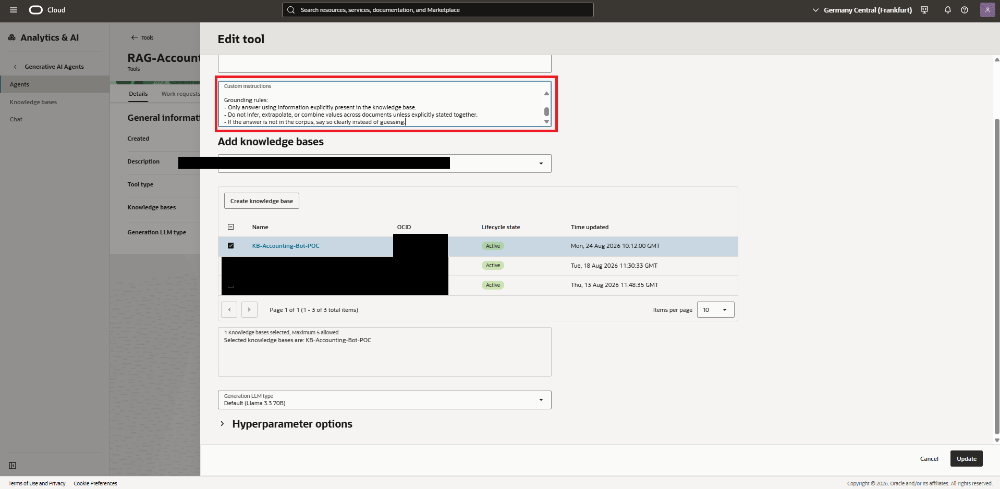

# Chapter 5 — Prompt Engineering & Guardrails

## Introduction

An agent that retrieves the right documents can still answer badly: inconsistent formatting, no source attribution, or confident guessing when the corpus has no answer. This chapter covers the two levers that shape agent behavior beyond retrieval itself — guardrails, which sit between the model and the user, and custom instructions, which shape how the RAG tool responds.



## Goal
Configure the agent's safety guardrails and tune the RAG tool's response behavior for grounded, well-formatted answers.

## Steps taken

### 5.1 Guardrails

During agent endpoint setup, all four guardrail categories (content moderation input/output, prompt injection protection, PII input/output) were reviewed.





**Decision: all guardrails set to Disable for this POC.**

This goes against the platform's own recommendation — Block is marked "recommended" for moderation and prompt injection. It was a deliberate choice for this internal, fictitious-data demo, not a default left unexamined.







### 5.2 Prompt / custom instructions

The RAG tool's custom instructions were edited after initial creation to enforce response formatting and strict grounding:

```
Response format:
1. Give a direct answer first.
2. If the answer involves multiple values (limits, dates, statuses), present them as a table.
3. Use bullet points for steps or lists.
4. End every response with a single line: "Source: [document name]"

Grounding rules:
- Only answer using information explicitly present in the knowledge base.
- Do not infer, extrapolate, or combine values across documents unless explicitly stated together.
- If the answer is not in the corpus, say so clearly instead of guessing.
```



## Design decisions
- **Guardrails disabled, documented as a conscious trade-off** rather than silently left at defaults.
- **Explicit grounding rules over implicit trust**: telling the model what to do when the answer isn't in the corpus is what makes the honesty check in Chapter 6 possible.

## Status
Complete
