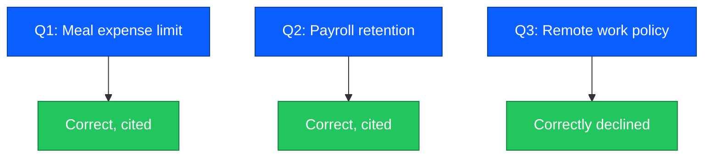
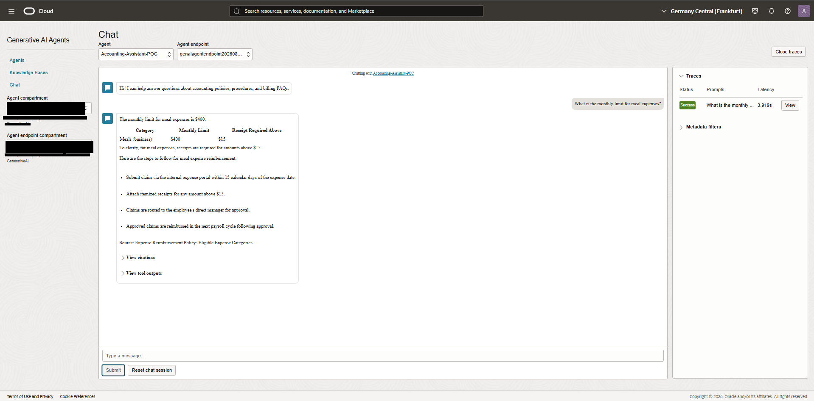
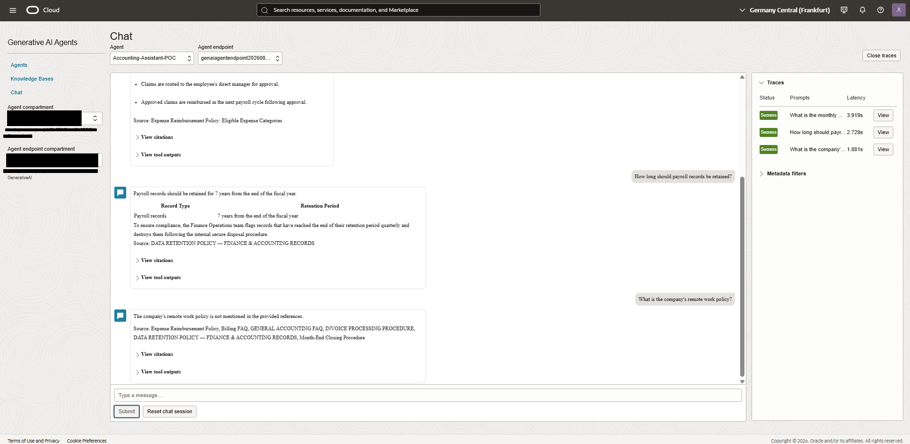

# Chapter 6 — Evaluation

## Introduction

A RAG pipeline that looks correct in a demo can still fail in practice: wrong values pulled from adjacent content, or confident answers to questions the corpus never covers. This chapter closes the loop by testing the agent against real questions and checking not just whether the answer sounds right, but whether it is actually grounded in the corpus.

## Goal
Validate that the agent answers correctly from the corpus and, just as importantly, that it does not hallucinate when the answer is not present.

## Method
Manual testing in the OCI Playground, one question at a time, checking both the answer and the citation panel, consistent with the retrieval-vs-generation diagnostic method used in Chapter 4.

## Questions tested

| # | Question | Expected | Result |
|---|---|---|---|
| 1 | What is the monthly limit for meal expenses? | 400 dollars, grounded in Expense Reimbursement Policy | Correct, cited |
| 2 | How long should payroll records be retained? | 7 years, grounded in Data Retention Policy | Correct, cited |
| 3 | What is the company's remote work policy? | Not in corpus, should decline, not invent | Correctly declined |

Note: a fourth planned question, about invoice statuses, was not captured in this evaluation run. Three of the four planned questions were tested.

## Results

*Correct answer, formatted as a table, with source citation, matches the response format defined in Chapter 5.*

*Payroll retention answered correctly and cited. The remote work question, not present in the corpus, is correctly declined instead of hallucinated, confirming the grounding rules from Chapter 5 work as intended.*

## Summary
- 2 out of 2 in-corpus questions answered correctly with accurate values and citations.
- 1 out of 1 out-of-corpus question correctly declined instead of hallucinated.
- No hallucinations observed in this run. This is a small manual sample, not a statistically rigorous evaluation, a larger automated test set would be needed to make stronger claims about hallucination rate at scale.

## Status
Complete, partial question set, see note above
