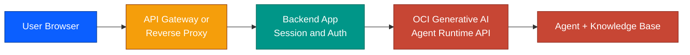

# Chapter 7 — Exposing the Agent (Conceptual Overview)

## Introduction

This chapter is conceptual: it describes, at a high level, how the agent built in this guide could be exposed behind a proper application layer instead of being used only through the OCI Console Playground. Nothing in this chapter was actually deployed in this repository, no screenshots, no live infrastructure. It is included as a text and diagram overview of the natural next step, useful as a reference for anyone planning to take this from POC to something usable.

## Why an application layer at all

The OCI Console Playground is fine for testing, but it is not something you hand to end users. Talking to the Agent Runtime API directly from a browser would also mean exposing the agent endpoint OCID and OCI credentials client-side, which is not acceptable outside a trusted internal tool. A thin backend in between solves both problems: it hides credentials server-side, and it gives you a normal web interface to put in front of users.

## Components

- **Backend application**: a small service (for example, a Python web framework) that receives chat messages from the frontend, calls `create_session` and `chat` against the OCI Generative AI Agent Runtime API, and returns the response. This is where the agent endpoint OCID and OCI authentication live, never in the browser.
- **Session handling**: the Agent Runtime API is session-based. The backend is responsible for creating a session per user conversation and reusing it across turns, rather than starting a new session on every message.
- **API Gateway or reverse proxy**: sits in front of the backend to handle routing, TLS termination, and optionally rate limiting or authentication before a request even reaches the backend. On OCI this could be API Gateway; outside OCI, any reverse proxy serves the same purpose.
- **Frontend**: a simple chat interface calling the backend over a normal HTTP API. Nothing about this is agent-specific, any standard web frontend works.

## What this adds over the Playground

- Removes the need for end users to have OCI Console access at all
- Keeps credentials and the agent OCID server-side, not in client code
- Allows adding application-level concerns the Playground does not have: authentication, per-user rate limiting, conversation history storage, custom branding
- Makes the agent embeddable anywhere a normal web app can be embedded

## What is intentionally left out of this repository

- No actual gateway or backend was deployed here, this repository stays focused on the RAG pipeline itself (Chapters 1 to 6)
- Authentication strategy, hosting choice, and scaling are deployment-specific decisions outside the scope of a from-scratch RAG tutorial

